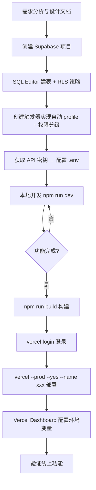

基于对全部 20 个源文件、4 个 SQL 迁移脚本、设计文档、部署文档的完整审查，以下是当前 GitHub 版本系统的全面详细总结。

---

## 项目跟踪管理系统 — 全面详细总结

---

### 一、系统技术架构

#### 1.1 整体架构图

```
┌────────────────────────────────────────────────────────────┐
│                     用户接入层                              │
│  ┌─────────┐  ┌─────────┐  ┌─────────┐  ┌─────────┐      │
│  │ 项目负责人A │  │ 项目负责人B │  │ 项目负责人C │  │ 项目负责人D │      │
│  └────┬────┘  └────┬────┘  └────┬────┘  └────┬────┘      │
│       │            │            │            │             │
│       └────────────┴─────┬──────┴────────────┘             │
│                          │ (浏览器 HTTPS)                   │
├──────────────────────────┼─────────────────────────────────┤
│                    部署层 (GitHub Pages)                    │
│              静态资源托管  base: /project-tracker/          │
├──────────────────────────┼─────────────────────────────────┤
│                    前端 SPA 层                              │
│        React 18 + TypeScript + Vite 5 + Recharts           │
│            HashRouter / CSS Modules / 无UI框架             │
├──────────────────────────┼─────────────────────────────────┤
│                   认证 & 数据层                             │
│             Supabase (PostgreSQL + Auth + RLS)              │
│    ┌──────────┬──────────┬──────────────┬──────────────┐   │
│    │ Auth API │ profiles │  projects    │weekly_reports│   │
│    │ (JWT)    │ (用户扩展)│  (项目表)     │  (周报表)     │   │
│    └──────────┴──────────┴──────────────┴──────────────┘   │
└────────────────────────────────────────────────────────────┘
```

#### 1.2 技术栈明细

| 层次 | 技术选型 | 版本 | 用途 |
|------|---------|------|------|
| **语言** | TypeScript | 5.5+ | 类型安全、编译检查 |
| **前端框架** | React | 18.3+ | UI 组件化 |
| **构建工具** | Vite | 5.4+ | 开发服务器 + 生产构建 |
| **路由** | react-router-dom (HashRouter) | 6.26+ | 客户端路由 |
| **图表** | recharts | 2.12+ | 趋势折线图、风险堆叠柱状图 |
| **样式方案** | CSS Modules | 原生 Vite 支持 | 作用域隔离、零运行时 |
| **认证** | Supabase Auth | v2.108+ | 邮箱+密码登录 / JWT | 
| **数据库** | Supabase PostgreSQL | — | 结构化数据存储 |
| **安全策略** | RLS (Row Level Security) | — | 行级权限控制 |
| **部署** | GitHub Pages | — | 免费静态托管 |

#### 1.3 部署架构

```
源代码 (GitHub feature/github-release)
    │
    ├── npm run build (tsc + vite build)
    │        │
    │        ▼
    │    dist/ (静态产物)
    │        │
    │        ▼
    └── GitHub Pages (https://kazxlo.github.io/project-tracker)
             │
             └── 静态资源 (base: /project-tracker/)
             
Supabase (独立服务)
    ├── PostgreSQL (数据存储)
    ├── Auth (用户认证)
    └── REST API (PostgREST 自动生成)
```

- 前端使用 `HashRouter` 而非 `BrowserRouter`，因为 GitHub Pages 不支持 SPA 的 fallback 路由
- Vite 配置 `base: '/project-tracker/'` 确保所有静态资源路径正确
- 生产构建通过 esbuild 的 `drop: ['console', 'debugger']` 移除所有日志输出

---

### 二、技术路线与演进

#### 2.1 设计文档中的初始方案

| 方案 | 描述 | 结论 |
|------|------|------|
| **方案A** — 手工 HTML | 每周生成静态 HTML 页面 | ❌ 数据无关联，无法趋势分析 |
| **方案B** — Web 管理系统 | React + Vercel KV 存储 | ✅ 采用 |

初始设计文档使用 Vercel KV + Vercel Functions 作为后端方案。

#### 2.2 实际落地时的技术路线变更

与设计文档相比，实际实现发生了以下重大变化：

| 维度 | 设计文档（方案B） | 实际实现 | 变更原因 |
|------|-------------------|----------|----------|
| **数据存储** | Vercel KV (键值存储) | **Supabase PostgreSQL** | 需要结构化查询、级联删除 |
| **API 层** | Vercel Functions (Serverless) | **Supabase PostgREST** (自动生成 REST API) | 减少后端代码，利用 SQL RLS 做权限 |
| **认证** | 简易密码登录 | **Supabase Auth** (邮箱+密码+JWT) | 专业认证、角色系统 |
| **部署平台** | Vercel | **GitHub Pages** | 免费、与 GitHub 深度集成 |
| **状态管理** | 未指定 | **React Context (useAuth)** + 组件本地状态 | 轻量，无 Redux 开销 |

#### 2.3 迭代历史（基于 Git 分支）

1. **初始阶段**：搭建 React + Vite 基础框架，实现 LocalStorage 本地存储版本（`storage.ts`）
2. **Supabase 迁移**：从 LocalStorage 迁移到 Supabase PostgreSQL（`db.ts` 替换 `storage.ts`），保留 `storage.ts` 用于向后兼容和 Demo 数据
3. **公共访问角色**：新增 `public` 角色，支持客户只读访客模式，通过 `VITE_PUBLIC_EMAIL` 环境变量配置
4. **截止时间管理**：projects 表新增 `deadline`、`deadline_extensions`、`last_deadline` 字段，实现逾期提醒和延期追踪
5. **权限升级**：从"所有人可读写"升级为基于角色的 RLS 策略（admin / member / public）
6. **安全性加固**：添加 CSP 策略、生产构建移除 console、pdfExport 添加 HTML 转义防 XSS

---

### 三、业务架构

#### 3.1 数据模型

```typescript
// 用户角色
type Role = 'admin' | 'member' | 'public';

// 项目 (projects 表)
interface Project {
  id: string;                   // 主键，如 "p1", "p2"
  name: string;                 // 项目名称
  owner: string;                // 项目负责人
  startDate: string;            // 启动日期 YYYY-MM-DD
  deadline?: string;            // 预估截止时间
  deadlineExtensions?: number;  // 已延期次数
  lastDeadline?: string;       // 上一次截止时间
  status: '正常推进' | '需关注' | '存在风险';
  color: string;                // 项目标识色 (蓝/绿/橙/紫)
}

// 周报事项
interface ReportItem {
  id: string;
  order: number;                // 序号
  title: string;                // 事项名称
  progress?: string;            // 子项目进展 (p1专用)
  acceptance?: string;          // 验收资料进展 (p1专用)
  detail?: string;              // 详细说明 (通用)
  reason?: string;              // 未完成原因 (计划事项)
  carriedForward?: boolean;     // 是否从上周带入
}

// 风险项
interface Risk {
  id: string;
  order: number;
  description: string;          // 风险描述
  suggestion: string;           // 解决建议
  level: '高' | '中' | '低';
  status: '待处理' | '已解决' | '持续关注';
  resolvedAt?: string;          // 已解决时间
}

// 周报 (weekly_reports 表)
interface WeeklyReport {
  id: string;
  projectId: string;
  weekLabel: string;           // "第12周"
  weekStart: string;           // YYYY-MM-DD
  weekEnd: string;
  goals: string;               // 建设目标
  highlights: string;          // 重点内容
  progress: number;            // 完成进度 0-100
  completedItems: ReportItem[];
  plannedItems: ReportItem[];
  risks: Risk[];
  createdAt: string;
  updatedAt: string;
}
```

#### 3.2 三层角色权限模型

| 角色 | 查看仪表盘 | 查看周报 | 新建/编辑周报 | 新建/编辑项目 | 用户管理 | 导出PDF |
|------|:---:|:---:|:---:|:---:|:---:|:---:|
| **admin** (管理员) | ✅ | ✅ | ✅ | ✅ | ✅ | ✅ |
| **member** (普通成员) | ✅ | ✅ | ✅ | ❌ | ❌ | ✅ |
| **public** (客户/访客) | ✅ | ✅(只读) | ❌ | ❌ | ❌ | ❌ |

**RLS 策略实现在 PostgreSQL 层**：
- `projects`：所有人可读，仅 admin 可增/改/删（SQL: `EXISTS (SELECT 1 FROM profiles WHERE id = auth.uid() AND role = 'admin')`）
- `weekly_reports`：所有人可读，admin/member 可写，仅 admin 可删
- `profiles`：所有人可读，用户只能插入自己的记录

---

### 四、业务功能全景

#### 4.1 页面路由矩阵

| 路由 | 页面组件 | 功能 | 受众 |
|------|---------|------|------|
| `/login` | `Login` | 邮箱+密码登录/注册 | 所有人 |
| `/` | `Dashboard` | 四项目卡片总览 + 整体汇总 + 逾期提醒 | admin/member/public |
| `/project/:id` | `ProjectDetail` | 单项目 KPI + 周报列表/趋势/客户视图 (Tab切换) | admin/member/public |
| `/project/:id/report/new` | `ReportEdit` | 结构化表单新建周报 | admin/member |
| `/project/:id/report/:reportId` | `ReportEdit` | 编辑已有周报 | admin/member |
| `/trends` | `Trends` | 进度趋势折线图 + 健康度趋势图 + 风险分布堆叠图 | admin/member/public |
| `/admin/users` | `AdminUsers` | 用户列表、角色管理 (切换 admin/member) | admin |

#### 4.2 核心业务功能详解

**1. 仪表盘 (`Dashboard`)**
- 四张项目卡片网格（2×2 布局），每张显示：完成进度%、周报期数、风险项数、状态标签、负责人
- 逾期提醒条：项目 deadline 已过但 progress < 100% 时显示橙色警告
- 整体汇总面板：累计完成事项、剩余计划事项、累计风险项、协作成员数 → **四项均可点击下钻查看明细**
- 工具栏：添加项目 (admin)、导出PDF (非public)、导出/导入数据 (admin)
- 项目编辑弹窗：支持修改名称、负责人、启动日期、截止时间（自动检测延期并计数）、状态、标识色

**2. 项目详情 (`ProjectDetail`)**
- 项目头信息 + 状态标签
- KPI 横条：当前进度、累计周报、完成事项、当前风险(可点下钻)、已处理风险(可点下钻)
- 三 Tab 切换：
  - **周报列表**：按时间倒序，每行显示周次/日期/完成/计划/风险统计
  - **进度趋势**：纯 CSS 柱状图（无 recharts，保持轻量）
  - **汇报视图** (`ClientViewPanel`)：干净可打印的客户汇报页面，包含建设目标、重点内容、本周工作情况、下周计划、风险提示

**3. 周报编辑 (`ReportEdit`)**
- **智能回填**：新建周报自动从上一期复制 goals/highlights/progress/completedItems/plannedItems
- **期数自动递增**：从上一期的"第N周"自动解析 +1
- **计划确认区**：确认上一周计划事项哪些已完成（✓ → 自动纳入本周完成事项），未完成项自动带入本周计划并附带原因
- **风险确认区**：确认上一周风险是否仍属于风险（否 → 标记为"已解决"并记录处理时间）
- **P1 特殊逻辑**：项目 p1 的完成事项使用三项子字段结构（子项目名称 + 进展 + 验收资料进展）
- **public 角色只读**：public 用户只能查看周报，不能编辑

**4. 趋势分析 (`Trends`)**
- **进度趋势 Tab**：Recharts LineChart 多线图，X轴=周次，Y轴=进度%，每条线一个项目
- **健康趋势 Tab**：
  - 活跃风险数量趋势（折线图）
  - 累计风险等级分布（堆叠柱状图，高/中/低三个 color）
- **最新进度汇总表**：各项目最新周次、进度、期数一览

**5. PDF 导出 (`pdfExport.ts`)**
- 生成包含所有项目的本周汇总 HTML 页面
- 未处理风险汇总区（跨项目、去重）
- 各项目详细内容区
- 所有用户输入均经过 `escapeHtml()` 转义，防止 XSS
- 通过 `window.open()` + `window.print()` 触发浏览器打印
- 支持 `@page { size: A4 }` 和 `print-color-adjust: exact`

**6. 用户管理 (`AdminUsers`)**
- 用户列表表格（显示名称、角色、注册时间）
- admin 可切换其他用户的角色（阻止自修改、阻止修改 public 账号）

#### 4.3 数据库级功能

```
Supabase DB Schema:
├── auth.users          (Supabase 内置)
├── profiles            (用户扩展：display_name, role)
│   └── 触发器: on_auth_user_created → 自动创建 profile
│       └── 首个用户自动设为 admin
├── projects            (项目表)
└── weekly_reports      (周报表，JSONB 存储完成/计划/风险数组)
    └── 外键: project_id → projects(id) ON DELETE CASCADE
```

- **RLS 行级安全**：所有表启用 RLS，策略按角色精细控制
- **数据导出/导入**：JSON 格式备份恢复，支持清空后覆盖导入
- **字段映射层**：`mapProject()` / `mapReport()` 处理数据库 snake_case ↔ 前端 camelCase 转换

---

### 五、开发思路与设计原则

#### 5.1 核心理念

| 原则 | 体现 |
|------|------|
| **保持轻量** | 无数据库服务器、无 Redux、无 SSR、无 UI 框架、CSS Modules 零运行时 |
| **同一数据源多视角** | 内部管理 + 客户汇报共用数据，通过角色 `public` 和 Tab 切换呈现不同视图 |
| **渐进增强** | LocalStorage → Supabase，先跑通再迁移，`storage.ts` 保留向后兼容 |
| **安全性前置** | CSP 策略、RLS 权限、生产构建移除 console、HTML 转义防 XSS |
| **中国化体验** | 全中文界面、中文周次标签、PingFang SC / Microsoft YaHei 字体、A4 打印 |
| **零成本运营** | GitHub Pages 免费托管 + Supabase 免费层 (500MB DB, 5万月活) |

#### 5.2 代码组织

```
src/
├── api/           # 数据访问层
│   ├── supabase.ts    # Supabase 客户端初始化
│   ├── db.ts          # 项目/周报 CRUD + 数据导入导出
│   ├── profiles.ts    # 用户 profile CRUD
│   └── storage.ts     # 旧 LocalStorage 层 (保留兼容)
├── components/    # 通用组件
│   ├── Layout.tsx     # 全局布局 + 导航 + 认证守卫
│   └── ErrorBoundary.tsx  # 错误边界
├── hooks/         # 自定义 Hooks
│   └── useAuth.tsx    # 认证 Context (login/logout/register + profile加载)
├── pages/         # 页面组件
│   ├── Login.tsx
│   ├── Dashboard.tsx
│   ├── ProjectDetail.tsx  # 含 ClientViewPanel 内嵌组件
│   ├── ReportEdit.tsx
│   ├── Trends.tsx
│   └── AdminUsers.tsx
├── styles/
│   └── shared.module.css  # 全部样式 (1122行)
├── types/
│   └── index.ts           # 全部类型定义
└── utils/
    └── pdfExport.ts       # PDF 导出工具
```

#### 5.3 关键设计模式

1. **认证守卫**：`Layout.tsx` 统一处理路由保护，未登录 → `/login`，已登录访问 `/login` → `/`，public → 拦截 `/report/new` 和 `/admin/users`

2. **取消竞态**：所有 `useEffect` 中的异步加载使用 `cancelled` 标志位防止内存泄漏和状态更新冲突

3. **数据预回填**：新建周报时自动从上一期周报继承内容，减少重复录入

4. **风险去重**：多个周报中相同 description 的风险只计一次（Dashboard 汇总和项目详情均实现）

5. **延期自动检测**：编辑项目截止时间时，若新日期 > 旧日期则自动 `deadlineExtensions++` 并记录 `lastDeadline`

6. **二次确认删除**：删除项目/周报需点击两次（"删除" → "确认删除？"），配合全局点击取消

7. **Toast 通知**：操作反馈统一通过顶部 Toast 组件，2.5 秒自动消失

---

### 六、遇到的问题总结

#### 6.1 敏感信息泄露事件

| 问题 | 描述 |
|------|------|
| **泄露文件** | `supabase-public-user.sql` 包含 `public@123.com` 的明文密码 |
| **影响范围** | 15 个 Git 提交历史中均存在该文件 |
| **解决方案** | `git filter-repo --path supabase-public-user.sql --invert-paths --force` 从历史中彻底清除 |
| **后续防护** | 将该文件加入 `.gitignore`，`git push --force-with-lease` 覆盖远程分支 |
| **残余风险** | GitHub 缓存/归档可能仍保留旧提交，建议同时修改 Supabase 中 public 账号密码 |

#### 6.2 网络与代理问题

- `git push` 时遇到 `Connection reset`（直连 GitHub 不稳定）
- 本地有 HTTP 代理 `127.0.0.1:7890`，需要在有代理和直连之间切换
- `filter-repo` 操作后 remote 被移除，需手动 `git remote add origin` 重新绑定

#### 6.3 数据库 schema 缓存问题

- Supabase 添加新列（如 `role`、`deadline`）后，PostgREST API 可能因 schema 缓存未刷新而返回 406 错误
- 解决方案：SQL 迁移脚本末尾添加 `NOTIFY pgrst, 'reload schema'`

#### 6.4 Supabase 触发器时序问题

- 用户注册后 `profiles` 表的触发器 `on_auth_user_created` 可能尚未执行完毕
- `useAuth.tsx` 中的 `loadProfile()` 实现了最多 3 次重试（间隔 800ms/1600ms/2400ms）来解决

#### 6.5 P1 项目的特殊需求

- 项目 p1（"在建项目验收管理"）的周报事项结构与其余三个项目不同
- 其他项目：`title` + `detail` 两项字段
- P1 项目：`title`（子项目名称） + `progress`（子项目进展） + `acceptance`（验收资料进展）三项字段
- 通过 `isP1` 标志在组件中做条件渲染来处理

#### 6.6 GitHub Pages SPA 路由问题

- GitHub Pages 不支持 SPA 的 `BrowserRouter`（刷新后 404）
- 解决方案：使用 `HashRouter`，URL 变成 `/#/project/p1` 形式

---

### 七、后续经验与建议

#### 7.1 安全实践

1. **`.env` 绝不提交** — `VITE_SUPABASE_URL` 和 `VITE_SUPABASE_ANON_KEY` 已在 `.gitignore` 中，部署时通过平台环境变量注入
2. **CSP 策略** — `index.html` 中配置了 Content-Security-Policy，限制脚本/样式/连接来源
3. **生产构建清理** — Vite 配置 `esbuild.drop: ['console', 'debugger']` 防止敏感日志泄露
4. **HTML 转义** — `pdfExport.ts` 对所有用户输入做 `escapeHtml()` 处理
5. **RLS 行级安全** — 鉴权逻辑下沉到数据库层，不依赖前端判断
6. **git filter-repo** — 一旦发现敏感文件提交，立即使用 filter-repo 重写历史，不要只删除文件

#### 7.2 架构经验

1. **"先跑通再迁移"模式有效** — `storage.ts` (LocalStorage) 让原型快速可用，`db.ts` (Supabase) 无缝替换
2. **保留旧代码层作为兼容** — `storage.ts` 虽然标记废弃但保留，便于离线演示或回退
3. **SQL RLS 策略比应用层鉴权更安全** — 即使前端代码被绕过，数据库层仍会拒绝未授权操作
4. **HashRouter 是 GitHub Pages 的最佳选择** — 无需 404.html hack
5. **Recharts 按需使用** — 趋势页用 Recharts，项目详情页用纯 CSS 柱状图，避免过度依赖图表库

#### 7.3 协作与部署

1. **建议使用 `git push --force-with-lease`** 而非 `--force`，防止覆盖他人提交
2. **Supabase 免费层足够小团队使用** — 500MB 数据库，5 万月活，无需付费
3. **触发器自动化** — `on_auth_user_created` 触发器自动创建 profile，首个用户自动设为 admin，减少手动设置
4. **环境变量模式** — `VITE_PUBLIC_EMAIL` / `VITE_PUBLIC_USERNAME` 支持不同部署环境配置不同的公共访问账号

#### 7.4 可扩展方向

| 方向 | 当前状态 | 可扩展为 |
|------|---------|---------|
| 周报导出 | 浏览器打印 PDF | 服务端生成 PDF (Puppeteer) |
| 通知提醒 | 无 | Supabase Edge Functions + 企业微信/邮件提醒 |
| 项目模板 | P1 硬编码特殊逻辑 | 项目级别的字段模板配置 |
| 多租户 | 单一团队 | Supabase organization 级别隔离 |
| 移动端 | 响应式 CSS（已有基础） | PWA 包装或微信小程序 |

---

以上是对当前 `feature/github-release` 分支版本的完整总结。该系统从最初设计文档的四项目周报管理需求出发，经历了从 Vercel KV 到 Supabase 的技术路线调整，最终形成了一套**轻量、安全、零成本、角色分权、设计清晰**的生产级周报管理工具。

# 项目跟踪管理系统 — 全过程总结与经验沉淀

---

## 一、项目概览

| 项目 | 详情 |
|------|------|
| **名称** | 项目跟踪管理系统 (Weekly Tracker 2026) |
| **业务场景** | 4人团队负责4个在建项目，需要统一填报周报、多视角可视化展示 |
| **上线地址** | `https://weekly-tracker-tawny.vercel.app` |
| **开发周期** | 2026-06-10 启动，当天完成设计与部署 |
| **Git 分支** | `feature/add-supabase` |

---

## 二、技术方案演进

最初的 `project-tracker-design.md` 设计了以下技术栈：

| 层级 | 原设计 | 最终实现 | 原因 |
|------|--------|----------|------|
| **数据存储** | Vercel KV | **Supabase (PostgreSQL)** | KV 无结构化查询、无外键约束、无认证集成，不满足协作需求 |
| **认证** | 简易密码（4人共享） | **Supabase Auth（邮箱+密码）** | 共享密码安全风险高，Supabase 自带认证 + RLS 行级安全 |
| **API 层** | Vercel Functions | **Supabase JS SDK 直连** | 减少中间层，前端直接调用 Supabase REST API（PostgREST） |
| **前端** | React 18 + Vite | **React 18 + Vite** | 保持不变 |
| **部署** | Vercel | **Vercel** | 保持不变 |

---

## 三、数据库设计

### 3.1 数据表结构

使用 **Supabase SQL Editor** 执行 `supabase-migration.sql` 创建三张表：

```
profiles         ← 用户扩展信息（id → auth.users 外键）
projects         ← 项目信息
weekly_reports   ← 周报数据（project_id → projects 外键，级联删除）
```

### 3.2 关键设计决策

1. **字段命名**：数据库用 `snake_case`（PostgreSQL 惯例），前端用 `camelCase`（JS 惯例），在 `db.ts` 中通过 `mapProject()`/`mapReport()` 做映射转换。

2. **JSONB 存储嵌套数据**：周报的 `completed_items`、`planned_items`、`risks` 三个字段使用 PostgreSQL 的 `JSONB` 类型，避免创建额外的子表，简化查询。

3. **RLS 行级安全策略**：所有表启用 RLS（Row Level Security），只允许已认证用户读写数据，无需后端 API 层即可保证数据安全。

---

## 四、认证系统

### 4.1 核心架构

```
用户注册 → Supabase Auth 创建 auth.users 记录
        → 数据库触发器 on_auth_user_created 自动创建 profiles 记录
        → 首个注册用户自动设为 admin
```

### 4.2 权限分级

| 角色 | 权限 |
|------|------|
| **admin** | 可增/改/删项目，可删周报，可管理用户 |
| **member** | 可读项目，可增/改周报 |

通过 `supabase-fix.sql` 的 SQL 触发器和更新后的 RLS 策略实现。

### 4.3 前端认证流程 (`useAuth.tsx`)

```
初始化 → getSession() 检查已登录会话
      → onAuthStateChange() 监听登录/登出
      → loadProfile() 获取用户显示名和角色（带重试机制）
```

---

## 五、前端实现

### 5.1 文件结构

```
src/
├── api/
│   ├── supabase.ts          ← Supabase 客户端初始化
│   └── db.ts                ← 项目/周报 CRUD + 字段映射 + 导入导出
├── hooks/
│   └── useAuth.tsx           ← 认证 Context（登录/注册/登出/角色）
├── pages/
│   ├── Login.tsx             ← 登录注册页
│   ├── Dashboard.tsx         ← 仪表盘（4项目卡牌总览）
│   ├── ProjectDetail.tsx     ← 单项目详情 + 周报时间线 + 趋势图
│   ├── ReportEdit.tsx        ← 周报编辑表单
│   ├── Trends.tsx            ← 趋势分析页
│   └── AdminUsers.tsx        ← 用户管理页
├── components/
│   ├── Layout.tsx            ← 全局布局（导航栏）
│   └── ErrorBoundary.tsx     ← 错误边界
├── types/                    ← TypeScript 类型定义
├── styles/                   ← CSS 样式
├── App.tsx                   ← 路由配置
└── main.tsx                  ← 入口文件
```

### 5.2 路由设计

| 路由 | 页面 | 面向受众 |
|------|------|---------|
| `/login` | 登录/注册 | 所有人 |
| `/` | 仪表盘（4项目概览） | 内部管理 |
| `/project/:id` | 项目详情 + 周报列表 | 内部管理 |
| `/project/:id/report/new` | 新建周报 | 项目负责人 |
| `/project/:id/report/:reportId` | 编辑周报 | 项目负责人 |
| `/trends` | 趋势分析 | 内部管理 |
| `/admin/users` | 用户管理 | admin |

---

## 六、部署流程

### 6.1 构建命令

```bash
npm run build    # 实际执行：tsc -b && vite build
```

构建产物输出到 `dist/` 目录。

### 6.2 Vercel 部署步骤

```
1. 本地构建: npm run build → dist/
2. 登录 Vercel CLI: vercel login（弹出浏览器授权）
3. 部署到正式环境: vercel --prod --yes --name weekly-tracker
```

### 6.3 环境变量配置

Vercel 部署后需要在 Dashboard 中配置：

| 变量名 | 说明 |
|--------|------|
| `VITE_SUPABASE_URL` | Supabase 项目 URL |
| `VITE_SUPABASE_ANON_KEY` | Supabase 匿名公钥 |

> 这些值已在 `.env` 文件中本地配置，`.gitignore` 排除了 `.env`，密钥不会泄露。

---

## 七、遇到的问题与解决方案

这是最有价值的部分 —— 踩过的坑和解决办法：

### 问题 1：PowerShell 执行策略阻止 npm

**现象**：直接执行 `npm run build` 报 PowerShell 脚本运行被禁用。

**解决方案**：用 **cmd** 替代 PowerShell 执行命令：

```cmd
set PATH=%USERPROFILE%\.workbuddy\binaries\node\versions\22.22.2;%PATH%
cd /d e:\PythonProj\ProjectM && npm run build
```

**教训**：在 Windows 环境下，IDE 的终端可能是 PowerShell 受限模式。遇到此类问题优先尝试用 cmd 执行，或在 PowerShell 中设置 `Set-ExecutionPolicy -Scope CurrentUser RemoteSigned`。

---

### 问题 2：Node.js 路径不在 PATH 中

**现象**：直接 `npm` 命令提示找不到。

**解决方案**：IDE 自带的 Node.js 安装在 `%USERPROFILE%\.workbuddy\binaries\node\versions\22.22.2` 下，需要每次在命令前手动设置 PATH。

**教训**：确认宿主机 Node.js 的实际安装路径，不同 IDE/工具链的路径可能不同。建议将 Node.js 路径加入系统环境变量一劳永逸。

---

### 问题 3：项目名称含大写字母被 Vercel 拒绝

**现象**：部署时报错 `Project name "ProjectM" contains invalid characters`。

**解决方案**：通过 `--name weekly-tracker` 指定全小写名称：

```cmd
vercel --prod --yes --name weekly-tracker
```

**教训**：Vercel 项目名只允许小写字母、数字和连字符。项目文件夹可以是大写，但部署名必须全小写。

---

### 问题 4：PostgREST Schema 缓存导致 406 错误

**现象**：执行 `supabase-fix.sql` 新增 `role` 列后，前端查询 `profiles` 表返回 406 Not Acceptable。

**根因**：PostgREST 对表结构有缓存，新增列后缓存未刷新，导致 REST API 不识新字段。

**解决方案**：
1. SQL 末尾加 `NOTIFY pgrst, 'reload schema';` 通知刷新缓存
2. 前端用 `select('*')` 而非指定具体字段，避免列名不匹配
3. 前端用 `maybeSingle()` 而非 `single()`，避免 0 行时也报 406

**教训**：修改 Supabase 表结构后，务必在 SQL 脚本末尾加 `NOTIFY pgrst, 'reload schema';`。前端查询策略要容错：用 `select('*')` + `maybeSingle()` 能避免大部分 406 问题。

---

### 问题 5：触发器执行时序导致 profile 读取失败

**现象**：用户注册后立即查询 `profiles` 表，有时查不到记录。

**根因**：SQL 触发器 `on_auth_user_created` 是异步的，注册完成后触发器可能尚未执行完毕。

**解决方案**：在 `useAuth.tsx` 中实现 **带重试的 profile 加载机制**：
- 注册成功后延迟 500ms 再查询
- 查询失败或查不到时，按 800ms/1600ms/2400ms 递增间隔重试最多 3 次

**教训**：依赖数据库触发器的场景，前端必须做 **延迟 + 重试** 的保护逻辑，不能假定触发器瞬间执行完毕。

---

### 问题 6：Vercel CLI 登录 Token 过期

**现象**：第一次 `vercel --prod` 报 token 无效。

**解决方案**：执行 `vercel login`（会弹出浏览器确认授权），登录成功后再部署。

**教训**：Vercel CLI 的 token 有有效期，过期后需要重新登录。`vercel login` 会在 `%USERPROFILE%\.vercel` 写入新 token，`.gitignore` 中已排除 `.vercel` 目录。

---

## 八、完整操作清单（后续项目复用）



---

## 九、关键经验提炼

| # | 经验 | 适用场景 |
|---|------|---------|
| 1 | **设计文档先行** → 技术选型、页面结构、数据模型都先写清楚再动手 | 所有项目 |
| 2 | **Supabase 替代自建后端** → 省去 API 层开发，直接 SDK 调用 + RLS 保安全 | 4-10人小团队项目 |
| 3 | **字段命名风格适配** → 数据库 snake_case ↔ 前端 camelCase，用 mapper 函数桥接 | 任何使用关系型数据库的前端项目 |
| 4 | **SQL 触发器 + 前端重试** → 解决数据库侧异步操作与前端即时查询的时序问题 | 依赖触发器的场景 |
| 5 | **pgrst schema cache** → 修改表结构后记得 `NOTIFY pgrst, 'reload schema'` | 使用 Supabase/PostgREST 的项目 |
| 6 | **Windows PATH 问题** → cmd 设置 PATH 比 PowerShell 设置环境变量更稳定 | Windows 开发环境 |
| 7 | **Vercel 命名规范** → 项目名只能小写字母+数字+连字符 | 部署到 Vercel 的项目 |
| 8 | **环境变量隔离** → `.env` 本地用，`.env.example` 做模板，`.gitignore` 排除 `.env` | 所有含密钥的项目 |
| 9 | **maybeSingle vs single** → 可能为空的查询用 `maybeSingle()` 避免 406 | Supabase 前端查询 |
| 10 | **SQL 脚本保留纯净** → `supabase-migration.sql`(初始建表) 和 `supabase-fix.sql`(修复脚本) 分开管理 | 任何数据库项目 |

---

## 十、后续优化方向（待办）

1. **客户汇报视图**：`/project/:id/report` 页面，纯展示无 UI 杂音，适合截图/导出给客户
2. **自动部署**：关联 Git 仓库后 `git push` → Vercel 自动构建部署
3. **邮件通知**：每周五自动提醒项目负责人填写周报
4. **周报导出 PDF**：浏览器打印样式优化
5. **数据备份**：定期 `exportAllData()` 导出 JSON 备份

---

以上就是在 Ask 模式下对整个项目的完整复盘。如果你需要我将这份总结写成 Markdown 文件保存到项目中，请切换到 **Craft 模式**，我可以帮你创建 `PROJECT_SUMMARY.md`。